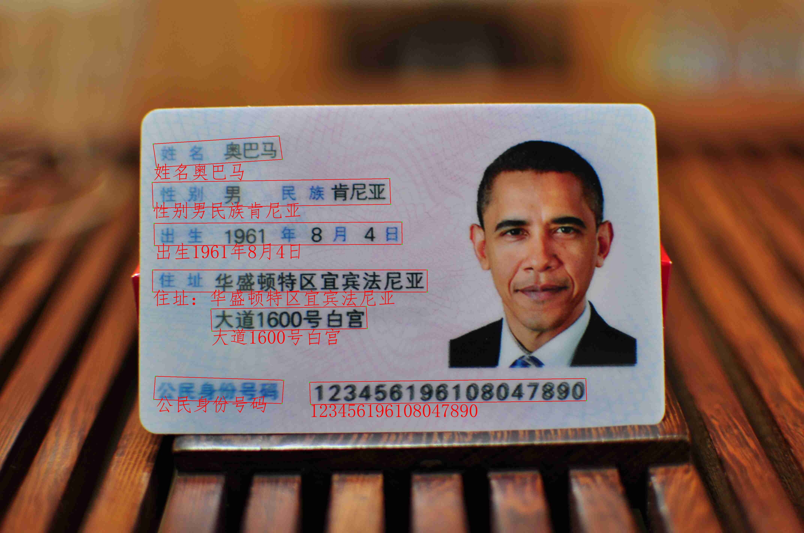

# ax-ocr
AX650部署PPOCRv3

## 用法

先在 https://github.com/ZHEQIUSHUI/ax-ocr/releases 下载模型，并解压

```
python3 python_ax/main.py images/aoguanhai.jpg
```
推理结果
```
123456196108047890
公民身份号码
大道1600号白宫
住址：华盛顿特区宜宾法尼亚
出生1961年8月4日
性别男民族肯尼亚
姓名奥巴马
```

